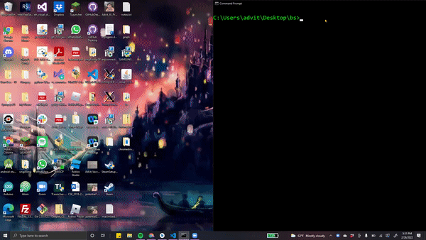
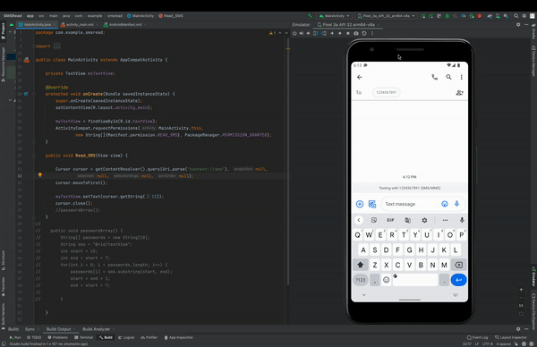
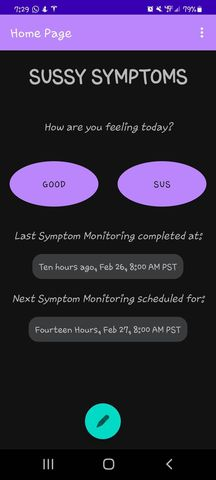

# Sussy Symptoms - HOTH Winter '22

> With Sussy Symptoms, you wont find yourself forgetting the Symptom Monitoring Survey ever again. Let automation take care of that inconvenient morning chore, so you can leave the dorm with a smile.

Sussy Symptoms is an application meant to enhance the experience of UCLA students
and faculty by streamlining the COVID Symptom Monitoring Completion Survey.

Using Kotlin, Java, and Selenium, our team prototyped an application with the following features:

* Scheduling - choose what days, times to complete monitoring survey
* Duo Push - uses SMS parsing to pass Duo's Multi-Factor Authentication
* Streamline - condenses questions into essentials: *are you sick today?*

Sussy Symptoms leverages technology to resolve the issues that many UCLA students face,
especially when running late for food, class, or other morning events.

## Demo Video(s)

&nbsp;&nbsp;

## No Introductions Needed...

**The Covid-19 Mandatory Daily Symptom Monitoring Survey.** 😢

Every UCLA student understands the struggle - the struggle of realizing you haven’t completed the symptom monitoring survey as you reach the doors of Bplate. The struggle of making your friends wait while you fumble around with your phone battling UCLA’s _weak_ wifi.

Sussy Symptoms is an app that completes your symptom monitoring survey for you! Our team's prototype streamlines the survey completion process, reducing each morning's tedious COVID-19 survey from several long-winded, meandering questions to one straightforward prompt.

_How are you feeling today?__ Good... or sus? 🤔

## Piece by Piece, Push by Push

The User Interface was developed using Kotlin Gradle, while we used Selenium and Python for the backend. A particularly challenging component was communicating with DuoMobile, the third party multi-factor authentication app called by the survey. This was developed using Java to read in the text-message pushed by the DuoMobile App to the users’ mobile device, and entering the verification code into the DuoMobile interface. Alternatively, a DuoPush is triggered by the Sussy Symptoms app, which then waits for the user to accept the request before proceeding to the next web page.

## Together, Triumphant

As Hackathon newbies, our team was grateful for this experience and the opportunity to learn and work with new tools and platforms. HOTH brought our teammates much closer, as we bounced off of each other’s ideas and bonded over app ideas. Creating something useful and meaningful to both ourselves and other students fills us with pride.

We look forward to building on this project in the future and automating the whole process, eventually enabling users to receive a clearance certificate by the time their alarm goes off in the morning!

Be on the lookout, _Sussy Symptoms_ coming to the App Store soon! 😄

&nbsp;&nbsp;
